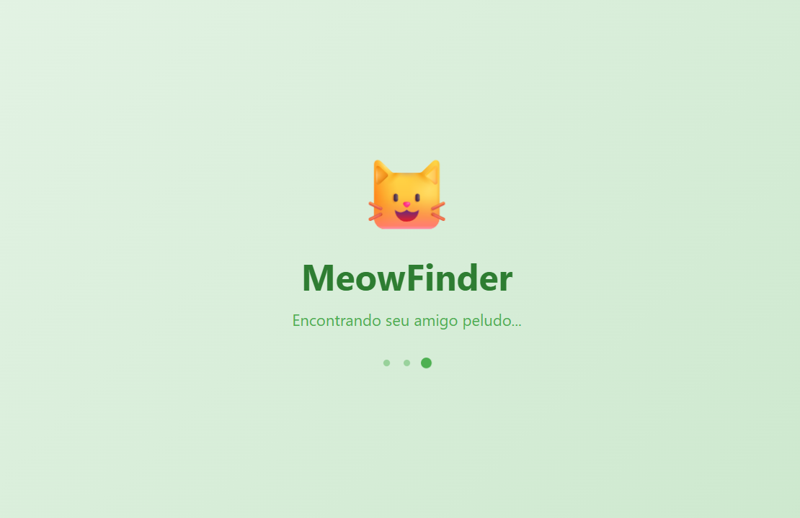
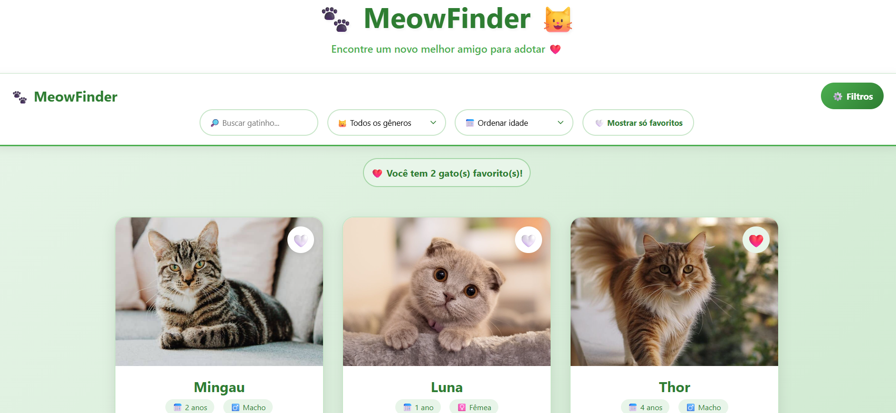

# MeowFinder

Aplicação web para adoção de gatos, desenvolvida com React + TypeScript + Vite.
# live: https://miaufinder.netlify.app
# Funcionalidades
- Listagem de gatos
- Sistema de favoritos (localStorage)
- Interface responsiva
- Feedback visual ao adotar

## Tecnologias
- React
- TypeScript
- Vite
- CSS

## 📸 Preview




## Como rodar

```bash
yarn
yarn dev
