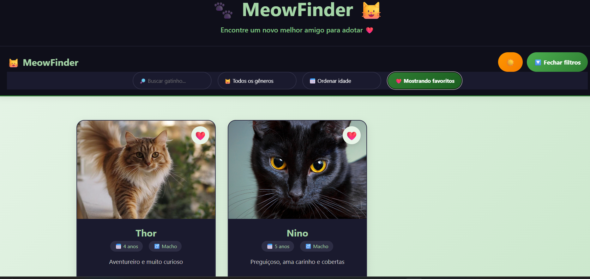
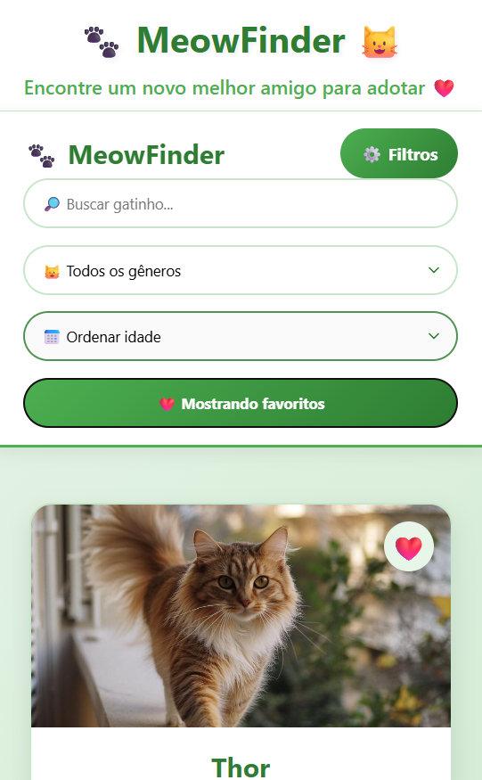

# MeowFinder

Aplicação web para adoção de gatos, desenvolvida com React + TypeScript + Vite.
# live: https://miaufinder.netlify.app
# Funcionalidades
- Listagem de gatinhos	Mostra todos os gatos disponíveis para adoção	
- Favoritos	Marcar/desmarcar gatos como favoritos com coração	
- Persistência de favoritos	Salva os favoritos no localStorage (não perde ao recarregar)	
- Busca por nome filtra gatos pelo nome digitado	
- Filtro por gênero	mostrar apenas machos, fêmeas ou todos	
- Ordenar por idade	ordenar mais velhos ou mais novos primeiro	
- Botão Adotar simula adoção com mensagem de confirmação (toast)	
- Tema escuro/claro	alterna entre modos claro e escuro (salva preferência)	
- Splash Screen	tela de abertura com animação (2 segundos)	
- Responsividade funciona bem em celular, tablet e desktop

## Tecnologias
- React
- TypeScript
- Vite
- CSS

## 📸 Preview





## Como rodar

```bash
yarn
yarn dev
